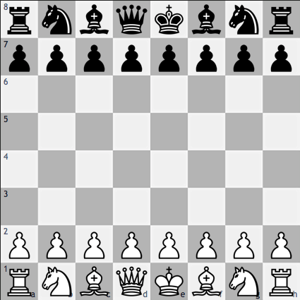

# ♖ Chess GUI 

- Chess GUI (Graphical User Interface) game made in SFML C++ Library


## 📖 Description
- Play chess!
- Graphical user interface
- Show possible moves when clicked on a specific piece
- Play against __AI__ (feature coming)


## Usage
- Left click to choose your piece
- - Now you can see all the possible moves!
- Choose where you want to move
- - Checkmate the other side! __♚♔__
# Getting Started

## ⬇️ Installation    

### If you have CMake installed:

Open your Command Prompt or Terminal

For a single-configuration generator (typically the case on Linux and macOS):

-
    ```bash
    cmake -S . -B build -DCMAKE_BUILD_TYPE=Release
    cmake --build build
    ```

For a multi-configuration generator (typically the case on Windows):

-    
   ```bash
    cmake -S . -B build
    cmake --build build --config Release
    ```


### Compiling it yourself with SFML:
1. Clone this repository
```bash
git clone https://github.com/SteponasK/Chess-SFML.git
```
1. Configure your project, using online [guide](https://www.sfml-dev.org/tutorials/2.6/start-vc.php) or a youtube [ video](https://www.youtube.com/watch?v=neIoDQ71yb0).

1. Compile all the files using Visual Studio or the IDE of your choice.
## 🏗️ Built With

* [SFML](https://www.sfml-dev.org/) - Software Development Library 
* [C++](https://cplusplus.com/)  Programming Language

## 👑 Authors
- Author - __Steponas K__

## License
- This project is licensed under the GNU General Public License. See the [LICENSE](LICENSE) file for more information.